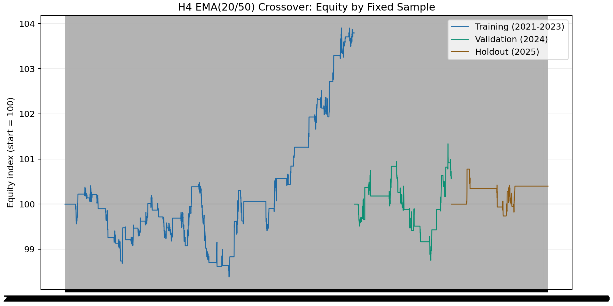
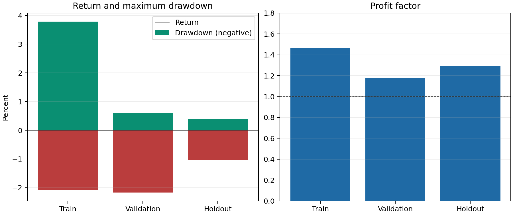
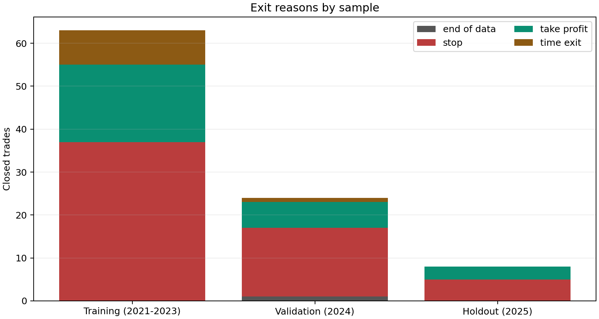

# Executive summary

This report records a reproducible, price-only H4 EMA crossover candidate. It
is the first non-volume strategy in this repository to pass the fixed proxy
research gates across training, validation, and final holdout. It is a
**broker-native testing candidate**, not a live-trading approval and not a
promise of profitability.

The selected rule is `MA05_H4_20_50_2p5x4`: EMA(20)/EMA(50) crossover on
completed H4 bars, with symmetric long and short entry, ATR-based protective
orders, a trailing stop, and a seven-day maximum holding time. Its result is
positive in the three fixed chronological samples, but the validation and
holdout samples contain only 24 and 8 trades respectively. That makes the
evidence encouraging but statistically thin. The intended next gate is a
broker-native XAUUSD bid/ask backtest in MT5, followed by demo forward testing.

| Sample | Period | Return | Maximum drawdown | Trades | Win rate | Profit factor |
|---|---|---:|---:|---:|---:|---:|
| Training | 2021-01-01 to 2023-12-31 | 3.79% | 2.08% | 63 | 42.86% | 1.46 |
| Validation | 2024-01-01 to 2024-12-31 | 0.60% | 2.17% | 24 | 37.50% | 1.18 |
| Final holdout | 2025-01-01 to 2025-12-31 | 0.40% | 1.03% | 8 | 37.50% | 1.29 |

{ width=96% }

# Scope and status

The project intentionally excludes volume from this live-testing path. XAUUSD
volume fields are venue- and broker-dependent, so volume-derived signals do
not transfer cleanly between public archives and an MT5 broker. The strategy
uses only OHLC prices and spread assumptions. It can trade both directions:
short entry is not a long-only proxy.

The public research data is weekday-only PAXGUSDT M5 data from 2021--2025,
resampled to H4. PAXGUSDT is a gold-linked public proxy rather than broker
XAUUSD. The simulation applies a fixed 0.35 USD round-trip spread model
(35 points at a 0.01 point size) and no commission. This is a useful,
reproducible screening assumption, but it cannot represent a particular
broker's variable spread, swaps, commissions, trading sessions, gaps,
rejections, latency, or fill policy.

# Strategy specification

## Signal

Let $F_t$ be the completed H4 EMA(20), $S_t$ be the completed H4 EMA(50), and
$t-1$ be the preceding completed H4 bar. A signal is evaluated only after an
H4 bar closes:

$$
Long_t = (F_t>S_t) \land (F_{t-1}\le S_{t-1})
$$

$$
Short_t = (F_t<S_t) \land (F_{t-1}\ge S_{t-1})
$$

The order is submitted at the following H4 bar's open. The backtester buys at
the ask and sells at the bid. This one-bar delay prevents use of an unclosed
bar and makes the signal/execution boundary explicit.

## Protective orders and exit logic

For entry price $E$ and signal-bar ATR(14) $A$:

$$
SL_{long}=E-2.5A,\quad TP_{long}=E+4.0A
$$

$$
SL_{short}=E+2.5A,\quad TP_{short}=E-4.0A
$$

The trailing stop distance is $2.5A$. A position is also closed at the end of
42 completed H4 bars, approximately seven calendar days. In an OHLC bar where
both protective levels could have been touched, the backtest uses the
conservative stop-first convention. This convention avoids assuming a
favourable intrabar path unavailable in bar data.

## Sizing and account locks

The research configuration risks 0.50% of current equity at the initial stop.
The MT5 EA uses `OrderCalcProfit` against the broker symbol to translate that
cash risk into a volume, then normalizes to the broker's minimum, maximum, and
step. New entries are blocked when the spread exceeds the configured limit,
when the daily equity loss reaches 2.0%, or when equity falls 20.0% from its
observed peak. The locks do not guarantee a loss limit: gaps, slippage,
execution failure, and existing positions can exceed it.

# Research protocol

## Candidate universe and selection discipline

Six pre-defined EMA crossover variants were evaluated before the final holdout.
The selection was not based on the 2025 result. H1 candidates required at
least 50 training trades; H4 candidates required at least 20. A training pass
required positive return, profit factor at least 1.10, and drawdown at most
15%. The validation gate retained the same return, profit-factor, and drawdown
requirements, with a minimum of six H4 trades. Among passed candidates, the
selection score was validation return divided by maximum drawdown, with profit
factor as a tie-breaker.

| Candidate | Interval | Training return | Training DD | Trades | Training PF | Training decision |
|---|---|---:|---:|---:|---:|---|
| MA01 EMA 10/30, 2x3 ATR | H1 | -18.57% | 20.02% | 424 | 0.76 | Reject |
| MA02 EMA 20/50, 2x3 ATR | H1 | -16.29% | 19.09% | 327 | 0.75 | Reject |
| MA03 EMA 20/100, 2.5x4 ATR | H1 | -9.03% | 10.36% | 191 | 0.75 | Reject |
| MA04 EMA 10/30, 2x3 ATR | H4 | 1.27% | 6.48% | 107 | 1.07 | Reject |
| **MA05 EMA 20/50, 2.5x4 ATR** | **H4** | **3.79%** | **2.08%** | **63** | **1.46** | **Validate** |
| MA06 EMA 50/100, 3x5 ATR | H4 | 2.16% | 2.00% | 35 | 1.49 | Validate |

In 2024, MA05 produced 0.60% return, 2.17% drawdown, 24 trades, 37.50% win
rate, and 1.18 profit factor. MA06 produced only five trades, below the
predefined H4 validation minimum, and was excluded. MA05 was therefore chosen
before exposing it to 2025. Its final 2025 holdout result was 0.40% return,
1.03% drawdown, 8 trades, 37.50% win rate, and 1.29 profit factor.

{ width=96% }

# Interpretation of the evidence

The strategy is trend-following, so a win rate below 50% is not contradictory
to a profit factor above 1.0: the model depends on winners being larger than
losers when a sustained move occurs. The result is more attractive on a
drawdown-adjusted basis than the rejected intraday price-only families, but it
is not high-return and has very limited independent trade count after
selection. A modest positive return can also be materially changed by a small
number of fills.

The chart below shows that the three samples have different mixes of stop,
target, trailing-stop, and time exits. It is diagnostic only; it must not be
interpreted as proof that those exit frequencies will repeat.

{ width=88% }

The prior volume-free price-reversal, session-breakout, compression-breakout,
and swing-trend attempts remain rejected negative evidence. The selected MA05
rule does not repair or override those results; it simply clears the stated
screening gates under this separate, pre-defined family.

# Implementation correspondence

`Experts/RegimeForgeMACrossoverEA.mq5` is the broker-test implementation.
Its default signal timeframe is H4; it reads EMA buffers at shifts 1 and 2,
which correspond to the two most recently completed H4 bars. It uses an ATR
buffer at shift 1, calculates position size with the broker contract via
`OrderCalcProfit`, supports long and short orders, and sets the initial SL/TP
on submission. It runs with `InpEnableNewEntries=false` by default.

The EA deliberately differs from an OHLC research model in unavoidable ways:
it works from live ticks, broker stop-distance constraints, current spread,
broker volume constraints, and actual trade-server responses. In MT5 testing,
ensure the account permits short selling and that the selected XAUUSD symbol
has a meaningful H4 history.

# Broker-native validation checklist

1. Compile `RegimeForgeMACrossoverEA.mq5` in MetaEditor without warnings that
   change trading logic.
2. Run MT5 Strategy Tester on the target XAUUSD symbol with the broker's
   highest-quality available bid/ask data and variable spread.
3. Use H4 signal timeframe, EMA 20/50, ATR 14, 2.5 ATR stop, 4.0 ATR target,
   2.5 ATR trailing distance, 42-bar time exit, and 0.50% risk per trade.
4. Verify that both buy and sell transactions occur, and inspect every order
   for normalized volume, SL, TP, stop-level compliance, and exit reason.
5. Test realistic commission and swap settings, including the broker's
   overnight financing and rollover schedule.
6. Compare trade timestamps and signal shifts: an order must follow a completed
   crossover bar, never use the in-progress H4 bar.
7. Run a separate, untouched out-of-sample interval and a demo forward test.
8. Keep entries disabled if the broker-native results are materially worse,
   trade count is insufficient, shorting is unavailable, or execution errors
   occur.

# Reproduction

```bash
python scripts/research_ma_crossover_candidates.py \
  data/derived/PAXGUSDT_5m_2021_2025_weekdays.csv \
  --output-json outputs/ma_crossover_candidates.json \
  --report reports/MA_Crossover_Candidate_Research.md

python scripts/generate_ma_crossover_charts.py \
  data/derived/PAXGUSDT_5m_2021_2025_weekdays.csv \
  --assets reports/assets \
  --trades outputs/ma_crossover_h4_trades.csv
```

The source data, code, fixed parameter grid, chronological split, and cost
assumption are all versioned in this repository. The generated `outputs/`
files are intentionally ignored because they are reproducible artifacts.

# Limitations and decision

This candidate is approved only for the next research gate: broker-native MT5
backtesting and controlled demo testing. It is not approved for production
capital. The proxy instrument, fixed cost model, low validation/holdout counts,
and absence of tick-path simulation prevent a credible claim of expected or
guaranteed profit. A failed broker-native test is a valid research outcome and
should result in disabling the EA rather than weakening the test standard.
