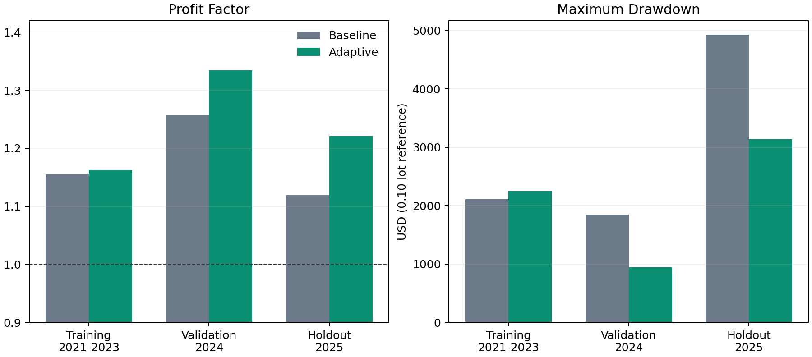
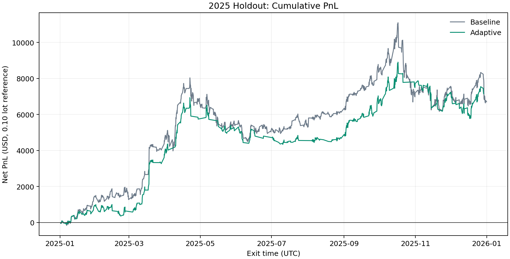
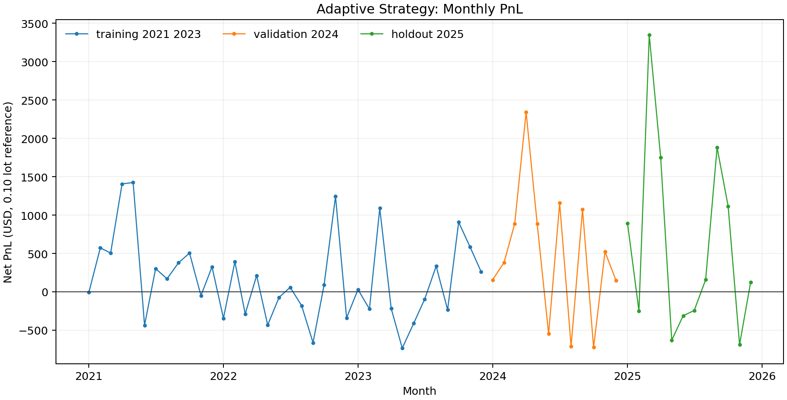

# Executive statement

This document is the detailed technical, quantitative, and operational record
for the current M5 volume-confirmed reversal candidate. It is intentionally
more conservative than a marketing report. It distinguishes between evidence,
assumptions, exploratory changes, and unproven claims.

The base factor passed a pre-defined proxy-data sequence: 2021-2023 training,
2024 validation, and a single 2025 holdout. The adaptive overlay was created
after reviewing the base rule's 2025 drawdown. Therefore, the adaptive result
is an exploratory risk-control result, not an untouched out-of-sample result.
It must be retested on independent broker-native XAUUSD Bid/Ask data before it
is considered suitable for any demo or live deployment.

# 1. Objective and decision boundary

The objective is not to prove that the strategy will make money. No historical
backtest can establish that. The objective is to identify a rule with a
repeatable proxy-data edge, make every execution assumption explicit, and
provide an MT5 implementation that a professional tester can invalidate or
confirm with broker-native data.

The strategy is permitted to open long positions only. It is designed to buy a
short-term oversold move when the bar's activity is unusually high, while the
completed H1 trend remains positive. This is a conditional mean-reversion
strategy, not a trend-following or grid system. It never averages down, never
adds to an open position, and permits at most one managed position at a time.

# 2. Data provenance and scope

## 2.1 Proxy data

Research data consists of weekday-only PAXGUSDT M5 bars from 2021 through
2025. PAXG is a gold-backed token and PAXGUSDT is used as a public,
gold-linked proxy. The associated trade volume is derived from public aggregate
trade archives. Archive checksums were verified during acquisition.

This source offers a long, reproducible public history. It does **not** provide
the exact liquidity, spread, session calendar, execution rules, tick volume, or
contract economics of any XAUUSD broker. Every proxy result in this document
must be read with that limitation.

## 2.2 Cost model

The order-level model applies a fixed 0.35 USD round-trip spread. A long entry
uses next-bar open plus half-spread. The fixed-time exit uses the configured
exit-bar close minus half-spread. No commission, swap, slippage, delay, partial
fill, margin rejection, trading halt, or spread expansion is modeled.

This cost model is deliberately simple. It is neither a best-case XAUUSD model
nor a substitute for MT5 real-tick testing. A professional tester must replace
it with actual bid/ask, commission, swap, and slippage behavior.

## 2.3 Position-size convention

Backtest dollar PnL uses a 0.10 lot / 100 oz reference only to make PnL and
drawdown intuitive. Profit factor, trade win rate, and net basis points do not
depend on this reference under the stated fixed-cost model. The current MQL5 EA
defaults to 0.02 lot as a conservative test volume, not as a universal sizing
recommendation.

# 3. Base alpha factor

Let $C_t$ be the close of the completed M5 signal bar and $V_t$ its volume.
The short-horizon return is:

$$r_3(t)=\frac{C_t}{C_{t-3}}-1$$

The lower threshold is a trailing 20th percentile over 20 trading days, or
5,760 M5 bars:

$$q_{20}(t)=Q_{0.20}\left(\{r_3(s):s<t\}\right)$$

The implementation shifts the threshold one completed bar. Consequently, the
signal bar is not included in its own reference distribution. This prevents a
future-data or self-inclusion error.

The volume surprise ratio is:

$$VR(t)=\frac{V_t}{SMA_{60}(V)_t}$$

The base entry condition is:

$$r_3(t)\le q_{20}(t)\quad\land\quad VR(t)\ge1.5$$

Interpretation: a three-bar downside move alone is not sufficient. The move
must occur with volume at least 50% above the trailing 60-bar average. The rule
attempts to capture an oversold liquidation or exhaustion event rather than a
routine price fluctuation.

# 4. Execution model

The chronological sequence for a signal is as follows:

1. M5 bar $t$ closes.
2. The strategy calculates $r_3(t)$, the shifted quantile, and $VR(t)$.
3. If all entry filters pass, it enters on the first tradable price of bar
   $t+1$.
4. The position remains open for 24 M5 bars.
5. It exits after the close of bar $t+24$.
6. No second entry is allowed while the first position is open.

The fixed 24-bar horizon equals 120 minutes. This horizon was one of the
pre-defined candidate choices in the order-level grid. It is not adjusted by
trade outcome, and the rule contains no martingale, recovery sizing, or
unbounded averaging mechanism.

# 5. Candidate selection protocol

## 5.1 Candidate universe

The direct M5 grid examined order-flow momentum, order-flow reversal,
order-flow absorption, return reversal, breakout reversal, and
volume-confirmed return reversal. The grid considered long and short signals,
all-hours and regional UTC sessions, and 5, 10, 15, 30, 60, and 120 minute
holding horizons.

## 5.2 Training gate

The 2021-2023 training gate required all of the following:

- At least 100 executed, non-overlapping trades.
- Profit factor of at least 1.10.
- Mean net return of at least 0.50 basis points per trade.

Candidates passing the gate were ranked by mean net basis points multiplied by
the square root of trade count. This score favors both average edge and sample
size, while avoiding a direct optimization of the 2025 holdout.

## 5.3 Validation and holdout gates

The training-selected row had to show at least 30 trades, PF of at least 1.05,
and mean net return of at least 0.25 bps in 2024. Only after validation passed
was the chosen base rule run once on 2025.

The selected base rule passed all three proxy periods. This is useful evidence,
but it is not a guarantee, because PAXGUSDT is not XAUUSD and the trading-cost
model is incomplete.

# 6. Base-rule results

| Sample | Trades | Net PnL (USD) | PF | Win rate | Mean net bps | Maximum drawdown (USD) |
|---|---:|---:|---:|---:|---:|---:|
| Training, 2021-2023 | 4,333 | 11,644.50 | 1.156 | 51.63% | 1.512 | -2,111.00 |
| Validation, 2024 | 1,428 | 7,832.00 | 1.257 | 55.04% | 2.447 | -1,847.00 |
| Holdout, 2025 | 1,350 | 6,707.20 | 1.119 | 55.41% | 1.768 | -4,927.40 |

The base rule has positive PF in each sample. Its critical weakness is not the
average trade; it is the tail behavior of a long-only reversion strategy during
persistent adverse regimes. The 2025 maximum drawdown is large relative to the
reference capital of a typical small test account.

# 7. Drawdown investigation

## 7.1 Observed concentration

The deepest base-rule 2025 drawdown occurred on 21 November 2025. The worst
2025 monthly PnL observations occurred in May, October, and December. This
pattern is consistent with a reversion rule repeatedly entering while downside
pressure remains persistent, rather than with a uniform deterioration across
all market conditions.

## 7.2 Why position size alone is insufficient

Lowering lots scales nominal drawdown but does not correct a regime mismatch.
For example, a 0.02 lot test volume reduces the approximate dollar exposure by
80%, but the strategy can still experience clustered losing signals. Position
sizing is necessary for account survivability; it is not a replacement for a
market-state filter or a risk lock.

## 7.3 Why the overlay is exploratory

The adaptive controls were proposed after the base-rule 2025 drawdown had been
observed. The result is useful for risk engineering, but it is no longer a
purely untouched holdout test. A new independent period, or broker-native
XAUUSD history unavailable during design, is required to assess the overlay
without this information leak.

# 8. Adaptive risk overlay

The overlay leaves the alpha formula unchanged. It only determines whether a
base signal may open a new position.

## 8.1 Completed-H1 trend confirmation

Let $EMA_{20}^{H1}(t-1)$ and $EMA_{50}^{H1}(t-1)$ be values on the most recently
completed H1 bar. Permit a long M5 signal only if:

$$EMA_{20}^{H1}(t-1)>EMA_{50}^{H1}(t-1)$$

The H1 shift is important. A strategy that uses the unfinished current H1 bar
can leak future intrabar information in a bar-based test.

## 8.2 Daily realized-loss lock

Let $B_d$ be the account balance at the broker-day start and $R_d$ the realized
PnL for the current day. Block future entries once:

$$R_d\le-0.02B_d$$

The EA uses balance, not floating equity, for this lock. It does not force-close
the open trade. It simply avoids compounding realized losses with new entries
until the next broker day.

## 8.3 Consecutive-loss cooldown

After four consecutive losing exits, the EA opens no new trade for 12 M5 bars.
The loss counter resets after a profitable exit. This is a simple, observable
state machine intended to reduce entry clustering during a failed reversion
episode.

# 9. Adaptive backtest results

| Sample | Trades | Net PnL (USD) | PF | Win rate | Mean net bps | Maximum drawdown (USD) |
|---|---:|---:|---:|---:|---:|---:|
| Training, 2021-2023 | 2,029 | 6,063.90 | 1.162 | 52.34% | 1.714 | -2,251.00 |
| Validation, 2024 | 790 | 5,565.00 | 1.334 | 56.58% | 3.131 | -946.00 |
| Holdout, 2025 | 828 | 7,151.00 | 1.221 | 56.64% | 2.768 | -3,134.50 |



The overlay improves PF in all displayed periods. It improves maximum drawdown
substantially in 2024 and 2025 but makes the training drawdown slightly worse.
The correct interpretation is not that the overlay is globally optimal. It is
a reasonable risk-control hypothesis that requires a fresh out-of-sample test.





# 10. MQL5 implementation specification

The implementation is located at `Experts/RegimeForgeVolumeReversalEA.mq5`.
Its operational behavior is designed to match the Python research semantics as
closely as an event-driven MT5 EA can.

| EA input | Default | Purpose |
|---|---:|---|
| `InpEnableNewEntries` | `false` | Requires explicit test activation. |
| `InpFixedLots` | `0.02` | Conservative initial test volume. |
| `InpReturnLookbackBars` | `3` | Three-bar return definition. |
| `InpQuantileBars` | `5760` | 20 trading-day M5 threshold window. |
| `InpLowerQuantile` | `0.20` | Oversold return percentile. |
| `InpVolumeMAPeriod` | `60` | Volume normalization window. |
| `InpMinimumVolumeRatio` | `1.50` | Volume surprise threshold. |
| `InpHoldBars` | `24` | 120-minute fixed exit. |
| `InpUseHigherTrendFilter` | `true` | Enables completed H1 confirmation. |
| `InpMaxDailyLossPct` | `2.00` | Daily realized-loss lock. |
| `InpMaxConsecutiveLosses` | `4` | Cooldown trigger. |
| `InpCooldownBars` | `12` | Cooldown duration. |

The EA uses MT5 tick volume because most XAUUSD brokers do not expose
exchange-traded volume. This difference from proxy aggregate-trade volume is
one of the main reasons the MT5 test is decisive.

# 11. MT5 Strategy Tester protocol

Use the broker symbol actually intended for testing, for example `XAUUSD`,
`XAUUSD.a`, or the broker's equivalent. Do not assume an arbitrary point value,
volume step, contract size, spread, or commission.

Recommended test procedure:

1. Compile the EA in MetaEditor and confirm there are no compiler warnings.
2. Select M5 and the most accurate available real-tick mode.
3. Enable `InpEnableNewEntries=true` only inside Strategy Tester.
4. Run the base configuration with trend filter and locks disabled.
5. Run the adaptive configuration with the documented defaults.
6. Repeat at 0.01, 0.02, and a broker-appropriate risk-sized volume.
7. Include actual commission, swap, and the broker's historical spread.
8. Export the deal list and equity curve for independent calculation.
9. Separate performance by year, session, spread percentile, and volatility.
10. Reject the candidate if positive proxy behavior disappears after realistic
    broker costs or if drawdown exceeds the predefined account risk budget.

# 12. Failure modes and rejection criteria

The strategy should be rejected, disabled, or redesigned if any of the
following occur in broker-native testing:

- PF falls below 1 after realistic costs over a sufficiently large sample.
- The H1 filter reduces trade count but does not improve risk-adjusted results.
- News, rollover, or spread expansion dominate losses.
- The volume proxy has no useful relationship with broker tick volume.
- A small number of exceptional trades account for most profits.
- The daily loss lock only postpones, rather than reduces, drawdown.
- Results are highly sensitive to one exact EMA, percentile, or hold-period
  parameter.

The most important rejection criterion is not a single losing month. It is a
lack of robustness across independent time periods and realistic broker costs.

# 13. Reproducibility commands

```powershell
python scripts/research_order_flow_absorption.py \
  data/derived/PAXGUSDT_5m_2021_2025_weekdays.csv \
  data/derived/PAXGUSDT_order_flow_5m_2021_2025.csv \
  --factor volume_return_3_reversal --bar-minutes 5 --hold-bars 24 \
  --side long --session-hours 0-23 --use-higher-trend-filter \
  --max-daily-loss-percent 2 --initial-equity 10000 \
  --max-consecutive-losses 4 --cooldown-bars 12 \
  --trades outputs/m5_adaptive_volume_reversal_trades.csv \
  --report reports/M5_Adaptive_Volume_Reversal_Backtest.md

python scripts/generate_adaptive_factor_paper_charts.py \
  outputs/m5_volume_reversal_holdout_trades.csv \
  outputs/m5_adaptive_volume_reversal_trades.csv \
  --assets reports/assets
```

# 14. Final conclusion

The evidence supports continued professional testing, not production trading.
The base factor has a coherent economic interpretation and positive
proxy-data results across its original training, validation, and holdout
sequence. The adaptive controls reduce observed recent-sample drawdown but are
exploratory because they react to a previously observed drawdown. The next
non-negotiable gate is an independent XAUUSD Bid/Ask test with realistic MT5
costs and execution. Until it passes, the EA should remain a test instrument.
