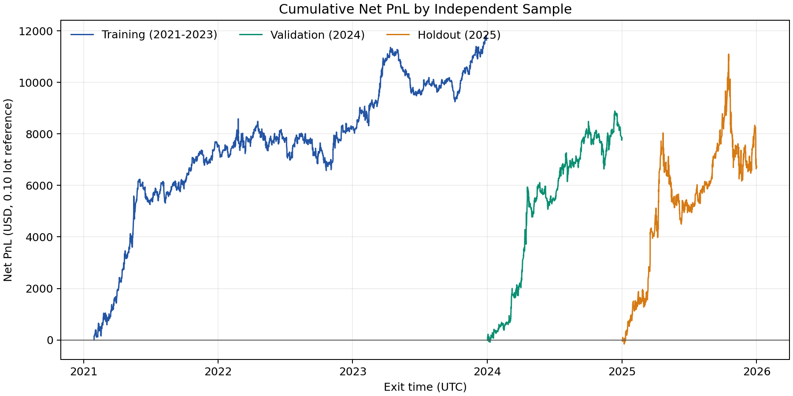
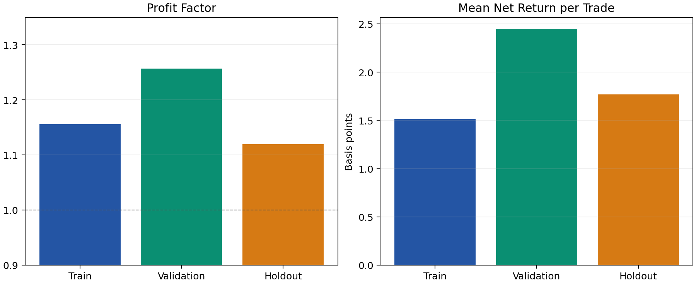
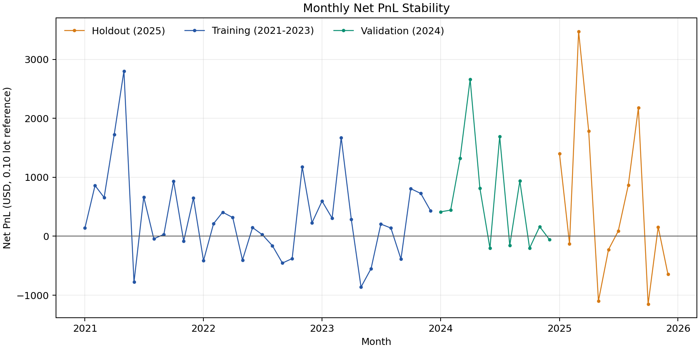

# Executive summary

This report documents a pre-specified M5 long reversal candidate that passed
2021-2023 training, separate 2024 validation, and untouched 2025 holdout
testing on public PAXGUSDT data. PAXGUSDT is a gold-linked proxy, not
broker-native XAUUSD. This is therefore a research candidate, not a claim of
XAUUSD or live profitability.

# Trading rule

Let $C_t$ and $V_t$ be M5 close and volume. Define:

$$r_3(t)=\frac{C_t}{C_{t-3}}-1$$

$$q_{20}(t)=Q_{0.20}(\{r_3(s):s<t\})$$

The quantile uses the preceding 20 trading days (5,760 M5 bars), shifted one
bar so it contains no current-bar information. Define:

$$VR(t)=\frac{V_t}{SMA_{60}(V)_t}$$

Open a long position only when:

$$r_3(t)\le q_{20}(t)\quad\land\quad VR(t)\ge1.5$$

Evaluate at M5 close, enter at the next M5 open plus half of a fixed 0.35 USD
round-trip spread, exit at the close of bar $t+24$ minus half spread, and
prohibit position overlap. The holding period is 120 minutes.

# Research protocol

The rule was selected only from 2021-2023 after a fixed direct order-level grid
covering order-flow, return-reversal, breakout-reversal, and volume-confirmed
reversal families; both directions; four UTC sessions; and 5-120 minute exits.
Training gates: 100+ trades, PF >= 1.10, and mean net return >= 0.50 bps.
Validation gates: 30+ trades, PF >= 1.05, and mean net return >= 0.25 bps. The
2025 holdout was inspected only after 2024 validation passed.

# Performance results

PnL uses 0.10 lot and 100 oz only to express dollars. PF, win rate, and bps
are position-size independent under the fixed-cost model.

| Sample | Trades | Net PnL (USD) | PF | Win rate | Mean net bps | Max drawdown (USD) |
|---|---:|---:|---:|---:|---:|---:|
| Training (2021-2023) | 4,333 | 11,644.50 | 1.156 | 51.63% | 1.512 | -2,111.00 |
| Validation (2024) | 1,428 | 7,832.00 | 1.257 | 55.04% | 2.447 | -1,847.00 |
| Holdout (2025) | 1,350 | 6,707.20 | 1.119 | 55.41% | 1.768 | -4,927.40 |







# Interpretation and professional-test handoff

All three independent proxy samples are positive after the fixed-spread
assumption: training PF 1.156, validation PF 1.257, and holdout PF 1.119. The
2025 result is weaker than validation and supports conservative risk gates.

This work does **not** test broker-native XAUUSD Bid/Ask bars, real fill
latency, slippage, commissions, swaps, symbol-specific contract parameters,
weekend gaps, or order rejection. A professional tester should reproduce the
exact rule on broker M5 or tick Bid/Ask history before demo or live use. The EA
must remain disabled for new entries until that test passes.

# Reproducibility

```powershell
python scripts/research_m5_order_flow_grid.py \
  data/derived/PAXGUSDT_5m_2021_2025_weekdays.csv \
  data/derived/PAXGUSDT_order_flow_5m_2021_2025.csv \
  --output outputs/m5_executable_factor_grid.csv \
  --report reports/M5_Executable_Factor_Grid.md

python scripts/research_order_flow_absorption.py \
  data/derived/PAXGUSDT_5m_2021_2025_weekdays.csv \
  data/derived/PAXGUSDT_order_flow_5m_2021_2025.csv \
  --factor volume_return_3_reversal --bar-minutes 5 --hold-bars 24 \
  --side long --session-hours 0-23 \
  --trades outputs/m5_volume_reversal_holdout_trades.csv \
  --report reports/M5_Volume_Reversal_Holdout.md
```
