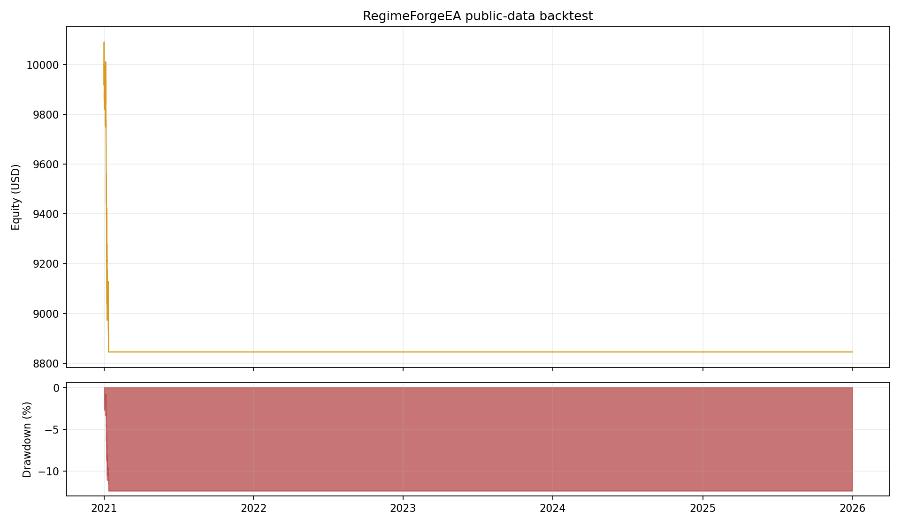

# Public-data backtest report

## Scope

This report evaluates the first RegimeForgeEA trend-breakout strategy on
`PAXGUSDT` 5-minute public market data from Binance Data Vision. PAXG represents
one fine troy ounce of vaulted physical gold, but PAXGUSDT is a 24/7 crypto
venue and is **not** an XAUUSD broker feed. Weekend UTC bars were removed to
reduce, not eliminate, the market-hours mismatch.

The test covers 2021-01-01T00:00:00+00:00 through 2025-12-31T23:55:00+00:00 and uses
375,413 bars. Results are a research proxy, not live-trading
validation.



## Headline results

| Metric | Result |
|---|---:|
| Initial equity | $10,000.00 |
| Final equity | $8,844.94 |
| Net profit | -$1,155.06 |
| Total return | -11.55% |
| Maximum drawdown | 12.35% |
| Trades | 44 |
| Win rate | 22.73% |
| Profit factor | 0.47 |
| Average trade | -$26.25 |
| Median trade | -$48.76 |
| Average R multiple | -0.28 |
| Long / short trades | 23 / 21 |
| Bar exposure | 0.06% |


## Continuous-strategy diagnostic

The primary run stopped opening positions after its peak-drawdown safety lock
was triggered; its last trade closed at `2021-01-11T23:15:00+00:00`. This lock is
deliberately persistent during one EA session. A second diagnostic run raised
both entry-lock thresholds to 100% while leaving the signal and trade parameters
unchanged:

| Metric | Risk-managed run | Continuous diagnostic |
|---|---:|---:|
| Total return | -11.55% | -98.87% |
| Maximum drawdown | 12.35% | 98.90% |
| Trades | 44 | 2054 |
| Win rate | 22.73% | 24.49% |
| Profit factor | 0.47 | 0.28 |

The diagnostic is not a deployable configuration. It exists to distinguish
strategy behavior from the safety lock's behavior.


## Annual breakdown

| Year | Equity return | Closed trades | Win rate | Realized P&L |
|---:|---:|---:|---:|---:|
| 2021 | -11.55% | 44 | 22.73% | -$1,155.06 |
| 2022 | 0.00% | 0 | 0.00% | $0.00 |
| 2023 | 0.00% | 0 | 0.00% | $0.00 |
| 2024 | 0.00% | 0 | 0.00% | $0.00 |
| 2025 | 0.00% | 0 | 0.00% | $0.00 |

## Strategy and execution assumptions

- Closed-bar M5 breakout signals with EMA(20) /
  EMA(50) direction and ADX(14)
  >= 20.0.
- High-volatility bars are excluded when ATR(14) divided
  by ATR(56) is at least
  1.80.
- Stop loss: 1.60 ATR; take profit:
  3.00 ATR; trailing stop:
  1.20 ATR.
- Risk per trade: 1.00% of marked equity.
- Synthetic spread: 35 points at a
  0.01 point size. No commission or swap was modeled.
- Signals execute at the next bar open. If stop and target are both touched
  within one OHLC bar, the stop is assumed to occur first.
- Position sizing uses a 100-unit contract to resemble a common XAUUSD CFD
  contract, not Binance spot execution.

## Data quality

| Check | Result |
|---|---:|
| Duplicate timestamps | 0 |
| Non-positive OHLC rows | 0 |
| Gaps over five minutes | 266 |
| Missing monthly archives | 0 |
| Archive verification | SHA-256 verified per monthly file |

Large gaps include scheduled weekend removal and exchange/data interruptions.
The downloader preserves UTC timestamps and verifies each archive against the
publisher-provided checksum.

## Interpretation

The result answers a narrow question: how the current rules behaved on a
gold-linked, high-frequency public proxy under explicit OHLC assumptions. It
does not establish expected profitability on XAUUSD. Before live use, the
strategy still requires:

1. Broker-native XAUUSD tick or M1 data with bid/ask prices.
2. MT5 Strategy Tester validation using real ticks.
3. Walk-forward parameter selection without tuning on the final test window.
4. Commission, swap, slippage, stop-level, and rejected-order modeling.
5. Demo forward testing through multiple volatility regimes.

## Reproduction

```bash
python scripts/download_binance_klines.py \
  --symbol PAXGUSDT --interval 5m \
  --start 2021-01 --end 2025-12 --weekdays-only \
  --output data/derived/PAXGUSDT_5m_2021_2025_weekdays.csv \
  --manifest-output reports/PAXGUSDT_2021_2025_data_manifest.json

python backtest/regime_forge_backtest.py \
  data/derived/PAXGUSDT_5m_2021_2025_weekdays.csv \
  --output outputs/paxgusdt_2021_2025

python backtest/regime_forge_backtest.py \
  data/derived/PAXGUSDT_5m_2021_2025_weekdays.csv \
  --max-daily-loss-percent 100 --max-drawdown-percent 100 \
  --output outputs/paxgusdt_2021_2025_continuous

python scripts/generate_backtest_report.py \
  --run outputs/paxgusdt_2021_2025 \
  --diagnostic-run outputs/paxgusdt_2021_2025_continuous \
  --data-metadata data/derived/PAXGUSDT_5m_2021_2025_weekdays.metadata.json \
  --report reports/PAXGUSDT_2021_2025.md \
  --chart reports/PAXGUSDT_2021_2025_equity.png
```

## Sources

- [Binance Spot Kline API and market-data endpoints](https://developers.binance.com/en/docs/catalog/core-trading-spot-trading/api/rest-api/market)
- [Binance Data Vision public archive](https://data.binance.vision/)
- [Paxos PAXG overview](https://docs.paxos.com/guides/stablecoin/paxg)
