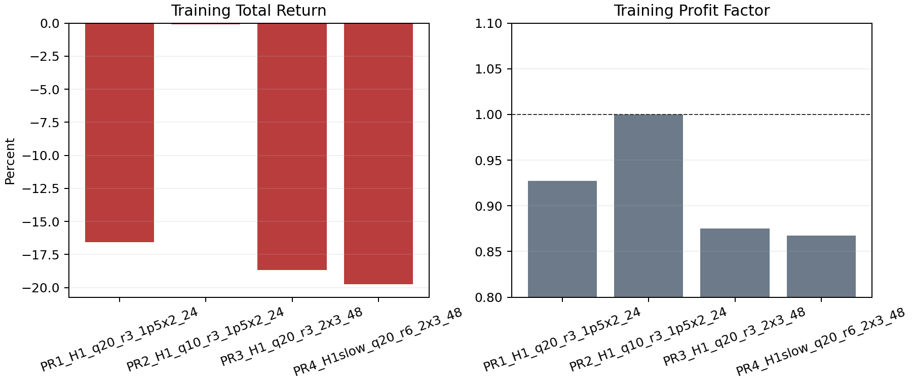
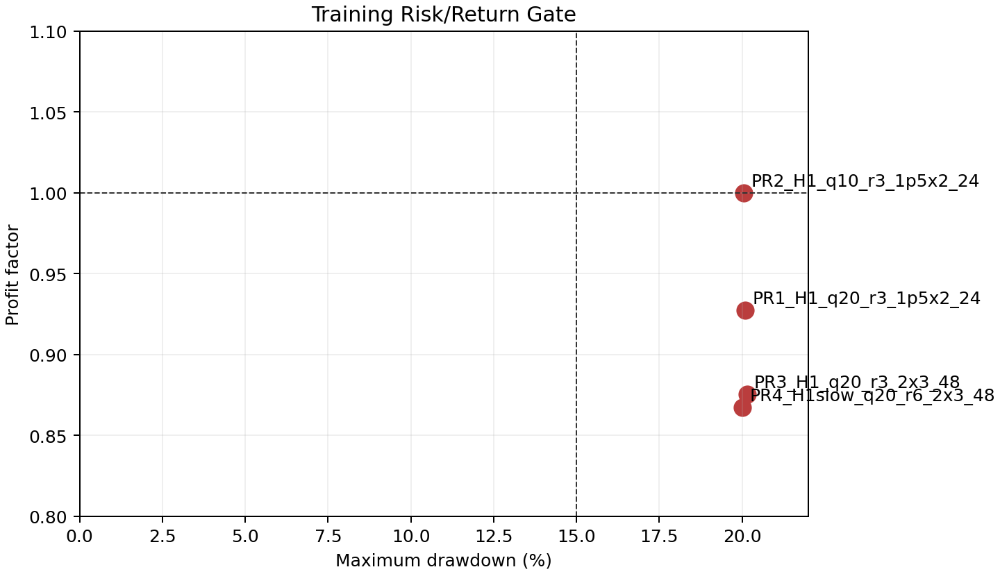

# Executive conclusion

This report records a price-only, long/short M5 candidate study designed to
meet stricter live-trading standards. It removes all volume inputs, uses
next-bar bid/ask execution, explicit ATR stop-loss and take-profit exits,
trailing stops, maximum holding periods, and account-level risk locks.

None of the four pre-defined candidates passed training. No candidate was
therefore allowed to proceed to 2024 validation or the 2025 final holdout. This
is a rejection report. The correct action is to keep the new price-only
candidate out of the MQL5 execution path until a future candidate passes the
same gates.

# 1. Reason for the revised study

Gold volume data are broker-dependent and inconsistent. Exchange activity,
broker tick volume, CFD internalization, and session coverage can produce very
different volume series. The earlier volume-confirmed proxy candidate is not an
acceptable live-trading specification under the trader review note.

The revised study removes `volume`, `tick_volume`, `real_volume`, aggregate
trades, and all order-flow fields from its signal definition. It uses only
price-derived OHLC features and completed higher-timeframe trend information.

# 2. Live-trading requirements encoded in the study

The following requirements were applied before any result was inspected:

1. Both long and short entries must be possible.
2. Entries must use completed M5 signals and execute at the next bar's bid/ask.
3. Every position must have an ATR stop-loss and ATR take-profit level.
4. A trailing stop and a maximum holding time must be active.
5. Risk sizing must use a fixed percentage of equity rather than a fixed lot.
6. A daily loss lock and a peak-drawdown entry lock must be active.
7. Training, validation, and final holdout periods must remain separated.
8. No volume-based signal or filter may be used.

# 3. Price-only factor

Let $C_t$ be the completed M5 close. For lookback $k$, define:

$$r_k(t)=\frac{C_t}{C_{t-k}}-1$$

Let $q_L(t)$ and $q_U(t)$ be trailing lower and upper return quantiles, shifted
one bar so that the signal bar is excluded:

$$q_L(t)=Q_q(\{r_k(s):s<t\}),\qquad q_U(t)=Q_{1-q}(\{r_k(s):s<t\})$$

Let the trend state be calculated from the prior completed H1 bar:

$$T_{up}(t)=EMA_{fast}^{H1}(t-1)>EMA_{slow}^{H1}(t-1)$$

$$T_{down}(t)=EMA_{fast}^{H1}(t-1)<EMA_{slow}^{H1}(t-1)$$

The symmetric signals are:

$$Long(t)=T_{up}(t)\land r_k(t)\le q_L(t)$$

$$Short(t)=T_{down}(t)\land r_k(t)\ge q_U(t)$$

A quantile-cross condition prevents repeatedly entering while the same return
remains at an extreme. The signal is still a trend-aligned pullback/reversal
idea, but it is entirely price-derived.

# 4. Protective exits and sizing

For entry price $E$ and signal-bar ATR $A$, long positions use:

$$SL=E-m_sA,\qquad TP=E+m_tA$$

Short positions use:

$$SL=E+m_sA,\qquad TP=E-m_tA$$

The engine resolves an OHLC bar touching both stop and target as stop-first,
which is a conservative convention. A trailing stop updates after bar close.
The position is also closed at the maximum configured holding time.

Position size is calculated from 0.25% equity risk and the initial stop
distance. New entries are blocked when the daily equity loss reaches 2% or
when the peak-equity drawdown reaches 20%.

# 5. Candidate universe

The universe was intentionally small to avoid broad parameter mining. All
candidates are M5 execution models with symmetric long and short rules:

| Candidate | H1 trend | Return quantile | Lookback | Stop / target | Trail | Maximum hold |
|---|---|---:|---:|---:|---:|---:|
| PR01 | EMA20 / EMA50 | 20% | 3 bars | 1.5 / 2.0 ATR | 1.2 ATR | 24 bars |
| PR02 | EMA20 / EMA50 | 10% | 3 bars | 1.5 / 2.0 ATR | 1.2 ATR | 24 bars |
| PR03 | EMA20 / EMA50 | 20% | 3 bars | 2.0 / 3.0 ATR | 1.5 ATR | 48 bars |
| PR04 | EMA20 / EMA100 | 20% | 6 bars | 2.0 / 3.0 ATR | 1.5 ATR | 48 bars |

# 6. Data and cost assumptions

The public study uses weekday-only PAXGUSDT M5 bars for 2021-2025 as a
gold-linked proxy. This is not broker-native XAUUSD data. A fixed 0.35 USD
round-trip spread is applied. Long entry uses ask-open and short entry uses
bid-open. Long exits use bid prices and short exits use ask prices.

This study excludes commission, swap, slippage, latency, partial fills, broker
stops-level restrictions, and real bid/ask historical behavior. Consequently,
passing this study would only authorize an XAUUSD broker-native test; it would
not authorize live deployment.

# 7. Time split and gates

The data split is fixed as follows:

| Stage | Period | Purpose |
|---|---|---|
| Training | 2021-2023 | Candidate gate and ranking |
| Validation | 2024 | Independent selection check |
| Holdout | 2025 | Final one-time evaluation |

Training requires at least 150 trades, PF >= 1.10, positive return, and maximum
drawdown <= 15%. Validation requires at least 50 trades and the same PF,
positive-return, and drawdown requirements. The holdout remains unread unless a
candidate passes both earlier stages.

# 8. Training results

| Candidate | Return | Maximum drawdown | Trades | Win rate | Profit factor |
|---|---:|---:|---:|---:|---:|
| PR01 H1 q20 r3, 1.5/2.0 ATR, 24 bars | -16.58% | 20.10% | 2,871 | 36.29% | 0.93 |
| PR02 H1 q10 r3, 1.5/2.0 ATR, 24 bars | -0.10% | 20.06% | 3,740 | 37.83% | 1.00 |
| PR03 H1 q20 r3, 2.0/3.0 ATR, 48 bars | -18.68% | 20.15% | 2,322 | 35.57% | 0.88 |
| PR04 H1 slow q20 r6, 2.0/3.0 ATR, 48 bars | -19.74% | 20.02% | 2,255 | 35.70% | 0.87 |





# 9. Interpretation of the negative result

The closest candidate, PR02, is approximately breakeven before a full broker
cost model, with PF 1.00 and a drawdown lock reached near 20%. This is not a
tradable edge. The other candidates lose materially in training.

The negative result is informative. Once volume is removed and symmetric short
trading is enforced, the simple higher-timeframe return-extreme rule does not
have enough edge to pay for stops, targets, spread, and realistic risk control.
Adding it to the EA would create the appearance of a live-ready strategy while
contradicting the evidence.

## 9.1 Subsequent independent price-only families

Three follow-on families were specified before their individual training runs and
used the same live-style bid/ask accounting, ATR protective exits, long/short
symmetry, 0.25% or 0.50% equity risk sizing, daily-loss lock, and peak-drawdown
lock. Neither was allowed to access validation or holdout data after failing
training.

| Family | Best training candidate | Trades | Return | Maximum drawdown | PF | Decision |
|---|---|---:|---:|---:|---:|---|
| Session opening-range breakout | New York 30-minute range, 2/3 ATR | 589 | -8.34% | 11.92% | 0.84 | Rejected |
| ATR-compression breakout | H1 compression 0.65, 18-bar breakout | 55 | -2.52% | 3.01% | 0.64 | Rejected |
| H4/D1 swing trend breakout | H4 EMA50/100, ADX20, 12-bar breakout | 73 | 0.65% | 4.08% | 1.06 | Rejected |

The D1 candidate with the highest PF recorded only seven training trades. It is
not evidence of an edge and was correctly excluded by the minimum-trade gate.
The H4 candidate with 73 trades is closer, but PF 1.06 remains below the 1.10
gate and is not eligible for validation.

# 10. Implications for the MQL5 EA

The existing volume-based EA must not be described as compliant with this new
volume-free live-strategy standard. The price-only `price_reversal` signal is
available in the Python engine for continued research, but no price-only MQL5
EA will be activated from this study because every candidate failed the first
gate.

The safe operational state is:

- Keep `InpEnableNewEntries=false` for any research EA by default.
- Do not substitute volume with broker tick volume merely to preserve the old
  factor; that would violate the trader review requirement.
- Do not add a short-selling feature to the MQL5 EA until a symmetric long/short
  candidate passes the stated research protocol.

# 11. Next research directions

The next candidate family should not be another small variation of the tested
return-reversal, session-breakout, or compression-breakout rules. More
defensible price-only directions include:

1. Price-action mean reversion only in statistically identified range regimes.
2. Separate long and short strategy families, each with independent evidence,
   rather than forcing symmetry where market microstructure is asymmetric.
3. Cross-market or macro features only when their timestamps and economic
   availability can be audited without look-ahead.

Each family must be pre-defined, tested with protective exits, and subjected to
the same train/validation/holdout gate before implementation.

# 12. Reproduction

```powershell
python scripts/research_price_only_live_candidates.py \
  data/derived/PAXGUSDT_5m_2021_2025_weekdays.csv \
  --output-json outputs/price_only_live_candidates.json \
  --report reports/Price_Only_Live_Candidate_Research.md

python scripts/generate_price_only_research_charts.py \
  outputs/price_only_live_candidates.json \
  --assets reports/assets

python scripts/research_session_breakout_candidates.py \
  data/derived/PAXGUSDT_5m_2021_2025_weekdays.csv \
  --output-json outputs/session_breakout_candidates.json \
  --report reports/Session_Breakout_Candidate_Research.md

python scripts/research_compression_breakout_candidates.py \
  data/derived/PAXGUSDT_5m_2021_2025_weekdays.csv \
  --output-json outputs/compression_breakout_candidates.json \
  --report reports/Compression_Breakout_Candidate_Research.md

python scripts/research_swing_trend_candidates.py \
  data/derived/PAXGUSDT_5m_2021_2025_weekdays.csv \
  --output-json outputs/swing_trend_candidates.json \
  --report reports/Swing_Trend_Candidate_Research.md
```

# 13. Final decision

No price-only candidate in the four completed families is approved for MQL5
integration, validation, or holdout testing. This preserves the live-trading
research standard: a rejected strategy remains rejected, even when the
requested design features are present.
